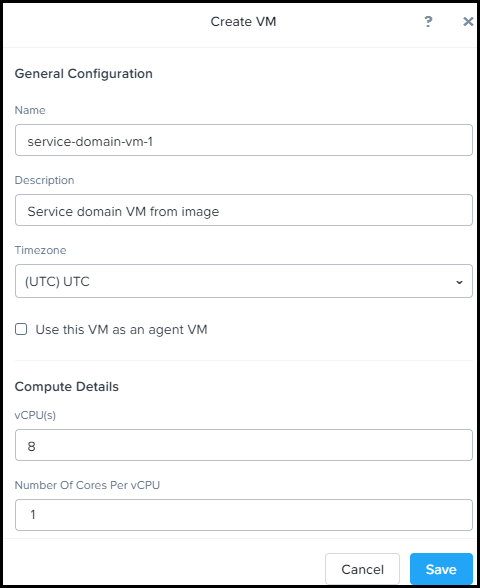
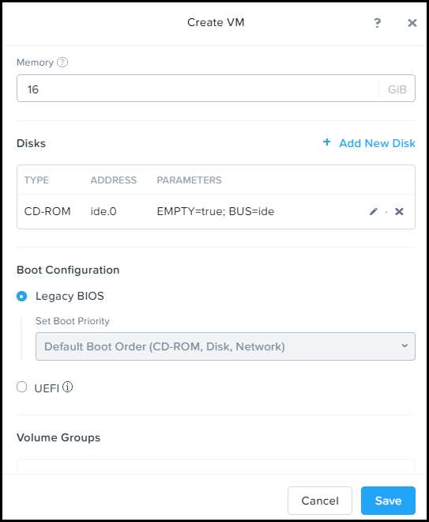
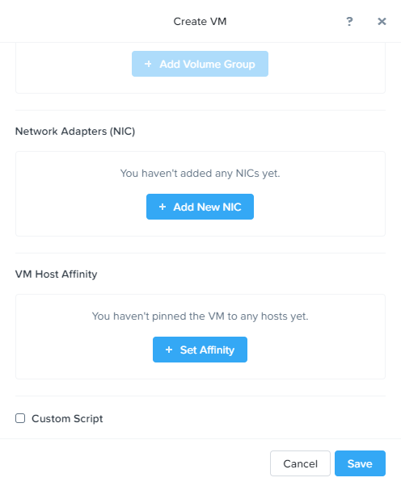
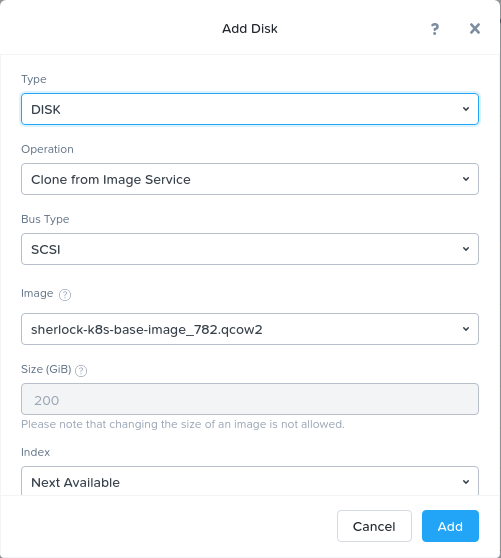

Deploy a Service Domain and add it to Karbon Platform Services (KPS)
====================================================================

KPS is a Kubernetes based multi-cloud PaaS that enables rapid
development and deployment of microservices-based applications ranging
from simple stateful containerized applications to complex AI, IoT and
hybrid applications across any cloud.

This tutorial will guide you through the deployment of a single node KPS
Service Domain on a Nutanix cluster, power it on and register it with
the KPS Cloud Management Portal (CMP).

After creating the Service Domain VM, note the VM IP address and ID in
the VM Details panel. You will need this information to add your Service
Domain in the Karbon Platform Services management console Service
Domains page.

--------------

Creating and deploying a KPS Service Domain
-------------------------------------------
|
1. Log on as an administrator to your cluster's web console through the
   Chrome web browser.
2. Click Home > VM, then click Create VM.

|

   
   **Figure. Create VM Dialog Box 1**
|    

   **Figure. Create VM Dialog Box 2**
|

   
   **Figure. Create VM Dialog Box 3**
|
The 'Create VM' dialog box appears. You might need to scroll down to see
everything that is displayed here.

3. Do the following in the indicated fields. You might require more memory and storage as determined by your applications.
   
  * Name: Enter a name for the VM
  * Description (optional): Enter a description for the VM
  * Use this VM as an agent VM: Do not select. Not used in this case
  * vCPU(s): Enter the number of virtual CPUs to allocate to this VM. For Karbon Platform Services, enter 8
  * Number of Cores per vCPU: Enter the number of cores assigned to each virtual CPU. For Karbon Platform Services, enter 1
  * Memory: Enter the amount of memory (in GiBs) to allocate to this VM. For Karbon Platform Services, enter 16

4. Click Add Disk to add the uploaded Karbon Platform Services image file.

|    

   **Figure. Add Disk Dialog**
|

  * Select Type > DISK
  * Select Operation > Clone from Image Service
  * Select Bus Type > SCSI
  * Select the Image you uploaded in Uploading the Service Domain Image
  * Keep the default Index selection
  * Click Add
  
|  
5. Click Add New Nic to assign the VM network interface to a vlan, then click Add.
6. Select Legacy BIOS to start the VM using legacy BIOS firmware. This choice is selected by default on AHV clusters supporting legacy or UEFI boot firmware.
7. Click Save.

The VM creation task progress appears in Tasks at the top of the web console::

      Note: You might require more storage as determined by your applications. Before first power on of the Service Domain VM, you can increase (but not decrease) the VM disk size.
      
      When the VM creation task is completed (the VM is created successfully), select the new Service Domain VM in the Table view, scroll to the bottom of the VM page, and click Update.
      
      Scroll to the disk, click the pencil icon to edit the disk, and increase the disk Size, then click Update and Save.

8. When the VM creation task is completed (the VM is created successfully), select the new Service Domain VM in the Table view, scroll to the bottom of the VM page, and Power On the VM.

  * Note the VM IP address and ID in the VM Details panel. You will need this information to add your Service Domain in the Karbon Platform Services management console Service Domains page.

9. If you are creating a multinode Service Domain, repeat these steps to create at least two more VMs for a minimum of three VMs. The additional VMs you create here can become nodes in a multinode Service Domain cluster, or remain unclustered individual/single node Service Domains.

--------------

Registering the KPS Service Domain with KPS Cloud Management Portal (CMP)
-------------------------------------------
|
1. Log on to the cloud management console at https://karbon.nutanix.com/.

2. Click Infrastructure > Service Domains > + Service Domain

3. Name your Service Domain

  * Starts and ends with a lowercase alphanumeric character
  * Maximum length of 63 lowercase alphanumeric characters
  * Dash (-) and dot (.) characters are allowed. For example, my-servicedomain.contoso.com is a valid Service Domain name

4. Select Single Node to create a single-node Service Domain
  * You cannot expand this Service Domain later by adding nodes

5. Click Add Node and enter the following node details:
  a. Serial Number of your Service Domain node VM
    * If a Nutanix AOS cluster hosts your Service Domain node VM: in the cluster Prism web console, open the VM page, select the Service Domain node VM, and note the ID
    * You can also display the serial number by opening this URL in a browser. Use your Service Domain node VM IP address: http://service-domain-node-ip-address:8080/v1/sn
  b. Name the node
  c. IP Address of your Service Domain node VM
  d. Subnet Mask and Gateway. Type the subnet mask and gateway IP address in these fields
  e. Click the check mark icon. To change the details, hover over the ellipses menu and click Edit

7. Click Add Category 

8. See Creating a Category. You can create one or more categories to add them to a Service Domain
  * Select a category and its associated value
  * Click Add to select another category and value

9. Click Next

10. Enter environment variables as one or more key-value pairs for the service domain. Click Add Key-Value Pair to additional pairs.

You can set environment variables and associated values for each Service Domain as a key-value pair, which are available for use in Kubernetes apps.

For example, you could set a secret variable key named SD_PASSWORD with a value of passwd1234.

For an example of how to use existing environment variables for a Service Domain in application YAML, see Using Service Domain Environment Variables - Example. See also Configure Service Domain Environment Variables.

11. If your Service Domain includes a GPU/vGPU, choose its usage case.
  * To allow access by any Kubernetes app or data pipeline, choose Use GPU for Kubernetes Apps and Data Pipelines
  * To allow access by AI Inferencing API (for example, if you are using ML Models), select Use GPU for AI Inferencing

12. To provide limited secure shell (SSH) administrator access to your service domain to manage Kubernetes pods. select Enable SSH Access
  * SSH Service Domain access enables you to run Kubernetes kubectl commands to help you with application development, debugging, and pod troubleshooting

13. Click **Add**

