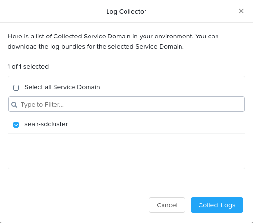

Check immediate logs of containers
====================================================================

KPS is a Kubernetes based multi-cloud PaaS that enables rapid
development and deployment of microservices-based applications ranging
from simple stateful containerized applications to complex AI, IoT and
hybrid applications across any cloud.

This tutorial will guide you to check the logs of applications deployed on a 
Service Domain in KPS Cloud Management Portal (CMP).

--------------

Checking logs of applications deployed on a KPS Service Domain with KPS Cloud Management Portal (CMP)
-------------------------------------------
|
1. Log on to the cloud management console at https://karbon.nutanix.com/.

2. Switch to the project where you deployed the Woodkraft application via the drop down list

3. Click Kubernetes Apps > Click on the Woodkraft application

.. figure:: img/k8sapps01.png
   :alt: K8s apps 01   
|

4. Click on 'View Real Time Logs' button

.. figure:: img/k8sapps02.png
   :alt: K8s apps 02   
|

You will notice that this is tailing the logs of all containers in this application. 

This is real time and will keep updating but will only show 2 MB worth as the purpose is to show the current logs.

5. Close this screen with the 'X' button at the top right 

6. To download the full log bundle from the Service Domain, click on 'Log Bundles'

.. figure:: img/k8sapps03.png
   :alt: K8s apps 03   
|

7. Click on 'Run Log Collector'

.. figure:: img/k8sapps04.png
   :alt: K8s apps 03   
|

8. Select the relevant KPS Service Domain and click on 'Collect Logs' button

|

9. Select the relevant KPS Service Domain and click on 'Collect Logs' button

10. It will take a moment to generate the log bundle for the Service Domain. Once it's completed, select the Service Domain and click on the 'Download' button. This will download the logs to your client machine

.. figure:: img/k8sapps06.png
   :alt: K8s apps 03   
|

**Note: It is also possible to configure log forwarding policies to an AWS S3 bucket**
