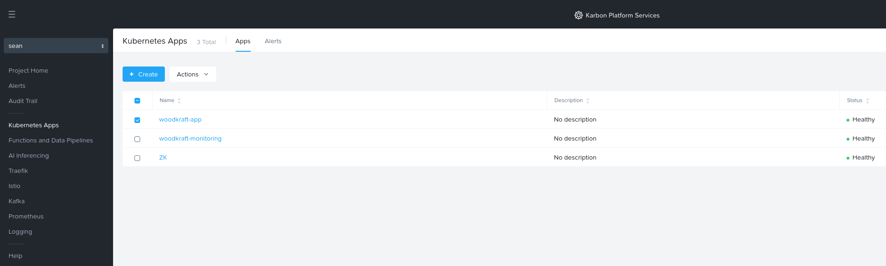

Check immediate logs of containers
====================================================================

KPS is a Kubernetes based multi-cloud PaaS that enables rapid
development and deployment of microservices-based applications ranging
from simple stateful containerized applications to complex AI, IoT and
hybrid applications across any cloud.

This tutorial will guide you to check the logs of applications deployed on a 
Service Domain in KPS Cloud Management Portal (CMP).

--------------

Checking logs of applications deployed on a KPS Service Domain with KPS Cloud Management Portal (CMP)
-------------------------------------------
|
1. Log on to the cloud management console at https://karbon.nutanix.com/.

2. Switch to the project where you deployed the Woodkraft application via the drop down list

3. Click Kubernetes Apps > Click on the Woodkraft application

|

4. Click on 'View Real Time Logs' button

.. figure:: img/k8sapps02.png
   :alt: K8s apps 01   
|

  * Starts and ends with a lowercase alphanumeric character
  * Maximum length of 63 lowercase alphanumeric characters
  * Dash (-) and dot (.) characters are allowed. For example, my-servicedomain.contoso.com is a valid Service Domain name

4. Select Single Node to create a single-node Service Domain
  * You cannot expand this Service Domain later by adding nodes

5. Click Add Node and enter the following node details:
  a. Serial Number of your Service Domain node VM
    * If a Nutanix AOS cluster hosts your Service Domain node VM: in the cluster Prism web console, open the VM page, select the Service Domain node VM, and note the ID
    * You can also display the serial number by opening this URL in a browser. Use your Service Domain node VM IP address: http://service-domain-node-ip-address:8080/v1/sn
  b. Name the node
  c. IP Address of your Service Domain node VM
  d. Subnet Mask and Gateway. Type the subnet mask and gateway IP address in these fields
  e. Click the check mark icon. To change the details, hover over the ellipses menu and click Edit

|
.. figure:: img/kpsaddsd01.png
   :alt: Add SD 01   
|

7. Click Add Category 

8. See Creating a Category. You can create one or more categories to add them to a Service Domain
  * Select a category and its associated value
  * Click Add to select another category and value

9. Click Next

10. Enter environment variables as one or more key-value pairs for the service domain. Click Add Key-Value Pair to additional pairs.

You can set environment variables and associated values for each Service Domain as a key-value pair, which are available for use in Kubernetes apps.

For example, you could set a secret variable key named SD_PASSWORD with a value of passwd1234.

For an example of how to use existing environment variables for a Service Domain in application YAML, see Using Service Domain Environment Variables - Example. See also Configure Service Domain Environment Variables.

11. If your Service Domain includes a GPU/vGPU, choose its usage case.
  * To allow access by any Kubernetes app or data pipeline, choose Use GPU for Kubernetes Apps and Data Pipelines
  * To allow access by AI Inferencing API (for example, if you are using ML Models), select Use GPU for AI Inferencing

12. To provide limited secure shell (SSH) administrator access to your service domain to manage Kubernetes pods. select Enable SSH Access
  * SSH Service Domain access enables you to run Kubernetes kubectl commands to help you with application development, debugging, and pod troubleshooting

|
.. figure:: img/kpsaddsd02.png
   :alt: Add SD 02   
|

13. Click **Add**

**Note: It takes between approx. 15-20 mins for the Service Domain to be fully registered and showing 'Healthy' status** 
